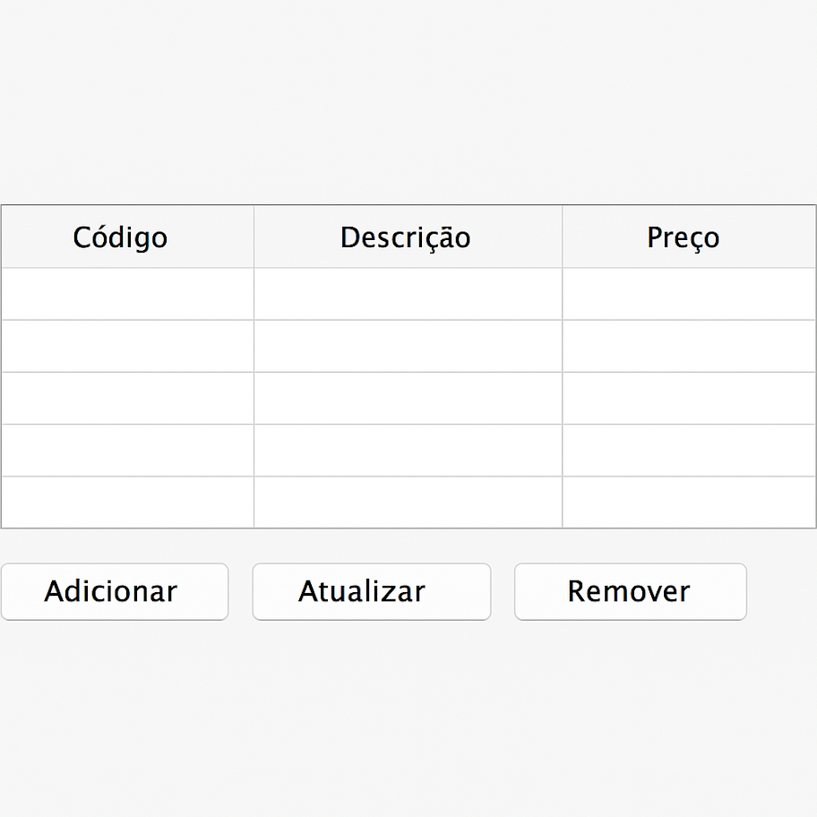

# Instruções

1. Modele a classe Produto (código, descricao, preco). Não esquecer do equals e hashCode e Serializable.
2. Reutilizar a classe GenericDao.
3. Construir a tela principal da aplicação. Segue protótipo.

$\quad$ Na versão final da atividade, realizar o salvamento, listagem, exclusão e atualização de produtos.

$\quad$ Protótipo:

